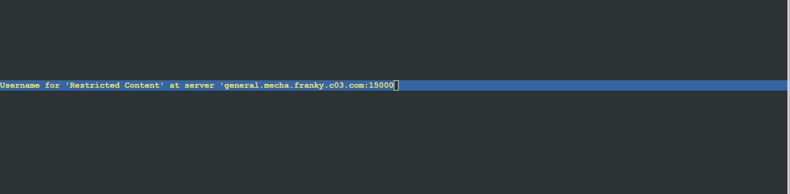

# Jarkom-Modul-2-C03-2021

Nama Kelompok :

- Junaedi Akbar 05111940000041
- Zydhan Linnar P.
- M. Fajri Davyza Chaniago 05111940000180

### Gambar Topologi

### Nomor 1
<<<<<<< HEAD
EniesLobby akan dijadikan sebagai DNS Master, Water7 akan dijadikan DNS Slave, dan Skypie akan digunakan sebagai Web Server. Terdapat 2 Client yaitu Loguetown, dan Alabasta. Semua node terhubung pada router Foosha, sehingga dapat mengakses internet.
<br>
Kami membuat topologi sesuai dengan Modul jarkom yang diberikan dengan melakukan konfigurasi untuk setiap node sebagai berikut  

##### Konfigurasi Foosha
```
auto eth0
iface eth0 inet dhcp

auto eth1
iface eth1 inet static
	address 192.217.1.1
	netmask 255.255.255.0

auto eth2
iface eth2 inet static
	address 192.217.2.1
	netmask 255.255.255.0
```

##### Konfigurasi Loguetown
```
auto eth0
iface eth0 inet static
	address 192.217.1.2
	netmask 255.255.255.0
	gateway 192.217.1.1
```

##### Konfigurasi Alabasta
```
auto eth0
iface eth0 inet static
	address 192.217.1.3
	netmask 255.255.255.0
	gateway 192.217.1.1
```

##### Konfigurasi EniesLobby
```
auto eth0
iface eth0 inet static
	address 192.217.2.2
	netmask 255.255.255.0
	gateway 192.217.2.1
```

##### Konfigurasi Water7
```
auto eth0
iface eth0 inet static
	address 192.217.2.3
	netmask 255.255.255.0
	gateway 192.217.2.1
```

##### Konfigurasi Skypie
```
auto eth0
iface eth0 inet static
	address 192.217.2.4
	netmask 255.255.255.0
	gateway 192.217.2.1
```
pada Foosha kami juga memasukkan command 
```bash
iptables -t nat -A POSTROUTING -o eth0 -j MASQUERADE -s 192.185.0.0/16
```
lalu pada setiap node selain foosha kami memasukkan perintah
```
echo "nameserver 192.168.122.1" > /etc/resolv.conf
```

### Nomor 2
Luffy ingin menghubungi Franky yang berada di EniesLobby dengan denden mushi. Kalian diminta Luffy untuk membuat website utama dengan mengakses franky.yyy.com dengan alias www.franky.yyy.com pada folder kaizoku.
<br>
Dalam mengerjakan soal ini, pertama kami melakukan konfigurasi terhadap file `/etc/bind/named.conf.local` dengan menambahkan kode berikut ini
```
zone "franky.c03.com" {
        type master;
        file "/etc/bind/kaizoku/franky.c03.com";
};
```
setelah membuat konfigurasi zone untuk franky.t12.com kami membuat direktori baru yaitu `/etc/bind/kaizoku` lalu menambahkan konfigurasi berikut ini pada `/etc/bind/kaizoku/franky.t12.com`
```
;
; BIND data file for local loopback interface
;
$TTL    604800
@       IN      SOA     franky.c03.com. root.franky.c03.com. (
                              2         ; Serial
                         604800         ; Refresh
                          86400         ; Retry
                        2419200         ; Expire
                         604800 )       ; Negative Cache TTL
;
@               IN      NS      franky.c03.com.
@               IN      A       192.185.2.4
www             IN      CNAME   franky.c03.com.
```
Pada file konfigurasi diatas kami mengatur domain menjadi franky.c03.com yang mengarah ke skypie lalu membuat CNAME www untuk franky.c03.com
<br>
untuk testing sendiri kita menggunakan
```
ping franky.c03.com 
```
=======

EniesLobby akan dijadikan sebagai DNS Master, Water7 akan dijadikan DNS Slave, dan Skypie akan digunakan sebagai Web Server. Terdapat 2 Client yaitu Loguetown, dan Alabasta. Semua node terhubung pada router Foosha, sehingga dapat mengakses internet

### Nomor 2

Luffy ingin menghubungi Franky yang berada di EniesLobby dengan denden mushi. Kalian diminta Luffy untuk membuat website utama dengan mengakses franky.yyy.com dengan alias www.franky.yyy.com pada folder kaizoku
>>>>>>> a64ecc01001656dcbca88a05bf2ca6f89899997e

### Nomor 3

Setelah itu buat subdomain super.franky.yyy.com dengan alias www.super.franky.yyy.com yang diatur DNS nya di EniesLobby dan mengarah ke Skypie

### Nomor 4

Buat juga reverse domain untuk domain utama

### Nomor 5

Supaya tetap bisa menghubungi Franky jika server EniesLobby rusak, maka buat Water7 sebagai DNS Slave untuk domain utama

### Nomor 6

Setelah itu terdapat subdomain mecha.franky.yyy.com dengan alias www.mecha.franky.yyy.com yang didelegasikan dari EniesLobby ke Water7 dengan IP menuju ke Skypie dalam folder sunnygo

### Nomor 7

Untuk memperlancar komunikasi Luffy dan rekannya, dibuatkan subdomain melalui Water7 dengan nama general.mecha.franky.yyy.com dengan alias www.general.mecha.franky.yyy.com yang mengarah ke Skypie

### Nomor 8

Setelah melakukan konfigurasi server, maka dilakukan konfigurasi Webserver. Pertama dengan webserver www.franky.yyy.com. Pertama, luffy membutuhkan webserver dengan DocumentRoot pada `/var/www/franky.yyy.com`.

#### Pada Skypie

Pertama kami menginstall apache2 dengan syntax
`apt-get install apache2 -y`

setelah itu membuat directory franky.c03.com di `var/www/`. Dan download file yang dibutuhkan

```
  mkdir /var/www/franky.c03.com
  wget https://raw.githubusercontent.com/FeinardSlim/Praktikum-Modul-2-Jarkom/main/franky.zip
  unzip franky.zip
  mv franky/* /var/www/franky.c03.com
```

<br> Untuk konfigurasi file dari subdomain tersebut akan dilakukan di `/etc/apache2/sites-available/franky.c03.com.conf` dan mengisinya dengan

```
 ServerAdmin webmaster@localhost
 DocumentRoot /var/www/franky.c03.com
 ServerName franky.c03.com
 ServerAlias www.franky.c03.com
```

Sehingga DocumentRoot dari subdomain www.franky.yyy.com akan terletak di `/var/www/franky.c03.com.`

#### Testing

Apabila di lynx dari LogueTown akan menampilkan isi dari /var/www/franky.c03.com.

```
  lynx www.franky.c03.com
```

Sehingga hasilnya akan sebagai berikut


### Nomor 9

Setelah itu, Luffy juga membutuhkan agar url `www.franky.yyy.com/index.php/home` dapat menjadi menjadi `www.franky.yyy.com/home`.

#### Pada Skypie

Tambahkan syntax berikut di dalam /etc/apache2/sites-available/franky.c03.com.conf

```
  Alias "/home" "/var/www/franky.c03.com/index.php/home"
```

Sehingga membuat /index.php/home akan berpindah ke /home saja.

#### Testing

Berikut ini tampilan apabila kita menggunakan lynx dengan url `www.franky.yyy.com/home`.


dan berikut tampilan lynx dengan url `www.franky.yyy.com/index.php/home`


Menghasilkan halaman yang sama

### Nomor 10

Setelah itu, pada subdomain `www.super.franky.yyy.com`, Luffy membutuhkan penyimpanan aset yang memiliki DocumentRoot pada `/var/www/super.franky.yyy.com`.

#### Pada Skypie

Buatlah folder baru di dalam /var/www/ dengan nama super.franky.c03.com, setelah itu melakukan command wget untuk mendapatkan file asset yang akan dimasukkan kedalamnya, setelah file di download akan langsung diunzip menggunakan command unzip dan memindahkan isi folder yang berupa asset lalu menghapus folder defaultnya.

```
  mkdir /var/www/super.franky.c03.com
  wget https://raw.githubusercontent.com/FeinardSlim/Praktikum-Modul-2-Jarkom/main/super.franky.zip
  unzip super.franky.zip
  mv super.franky/* /var/www/super.franky.c03.com
  rm -r super.franky
```

Di dalam /etc/apache2/sites-available/ dibuat juga file dengan nama super.franky.c03.com.conf dan diisi dengan

```
  ServerAdmin webmaster@localhost
  DocumentRoot /var/www/super.franky.c03.com
  ServerName super.franky.c03.com
  ServerAlias www.super.franky.c03.com
```

Hal ini membuat DocumentRoot dari subdomain `www.super.franky.c03.com` akan terletak di `/var/www/super.franky.c03.com.`

#### Testing

Jalankan lynx pada LougeTown

```
  lynx www.super.franky.c03.com
```

Sehingga hasilnya akan sebagai berikut


### Nomor 11

Akan tetapi, pada folder `/public`, Luffy ingin hanya dapat melakukan directory listing saja

#### Pada Skypie

Untuk membuat directory listing, kami menambahkan konfigurasi di /etc/apache2/sites-available/super.franky.c03.com.conf sebagai berikut

```
  <Directory /var/www/super.franky.c03.com/public>
    Options +Indexes
  </Directory>
```

#### Testing

Apabila kita melakukan lynx ke www.super.franky.c03.com akan menampilkan directory listing.

```
lynx www.super.franky.c03.com
```

Sehingga hasilnya akan sebagai berikut


Dan berikut tampilan folder publicnya


### Nomor 12

Tidak hanya itu, Luffy juga menyiapkan error file 404.html pada folder `/error` untuk mengganti error kode pada apache

#### Pada Skypie

Edit konfigurasi file pada /etc/apache2/sites-available/super.franky.c03.com.conf sebagai berikut.

```
ErrorDocument 404 /error/404.html
  <Files "/var/www/super.franky.c03.com/error/404.html">
	  <If "-z %{ENV:REDIRECT_STATUS}">
		  RedirectMatch 404 ^/error/404.html$
	  </If>
  </Files>
```

Dalam file tersebut kami menambahkan ErrorDocument dan Files sehingga apabila muncul error code 404 pada web akan meredirect menuju file 404 yang sudah disiapkan yaitu /error/404.html

#### Testing

Lakukan lynx pada LogueTown dengan url random `lynx super.franky.c03.com/wqioeuqw` <br>
Sehingga hasilnya akan sebagai berikut


### Nomor 13

Luffy juga meminta Nami untuk dibuatkan konfigurasi virtual host. Virtual host ini bertujuan untuk dapat mengakses file asset www.super.franky.yyy.com/public/js menjadi www.super.franky.yyy.com/js

#### Pada Skypie

Edit konfigurasi pada /etc/apache2/sites-available/super.franky.c03.com.conf sebagai berikut

```
  Alias "/js" "/var/www/super.franky.c03.com/public/js"
```

Maksud dari Alias disini akan mentranslate direktori web `/js` menjadi `/public/js`

#### Testing

Lakukan lynx pada LogueTown <br>

```
  lynx super.franky.c03.com/js
```

Sehingga hasilnya akan sebagai berikut


### Nomor 14

Dan Luffy meminta untuk web `www.general.mecha.franky.yyy.com` hanya bisa diakses dengan port 15000 dan port 15500

#### Pada Skypie

Masukkan port 15000 dan port 15500 pada file etc/apache2/sites-available/general.mecha.franky.c03.com.conf sebagai berikut

```
<VirtualHost *:15000 *:15500>
	...
	//ISINYA SAMA SEPERTI PORT 80 (Line 15 hingga 53)
	...
</VirtualHost>
```

Sehingga link web www.general.mecha.franky.yyy.com hanya akan bisa diakses dengan port 15000 dan port 15500

#### Testing

```
  lynx general.mecha.franky.c03.com:15000
```

Berikut adalah hasilnya



Sehingga perlu memasukkan username dan password untuk autentikasi yang akan dijelaskan pada nomor selanjutnya

### Nomor 15

Dengan autentikasi username luffy dan password onepiece dan file di /var/www/general.mecha.franky.yyy

#### Pada Skypie

Jalankan perintah berikut untuk mengatur basic authentication yang disimpan pada file `/var/www/general.mecha.franky.c03` dengan username luffy dan password onepiece

```
  htpasswd -b -c /var/www/general.mecha.franky.c03 luffy onepiece
```

#### Testing

Lakukan lynx pada LogueTown

```
lynx general.mecha.franky.c03.com:15000
```


Selanjutnya kita akan diminta untuk mengetikkan username dan password, ketika benar maka akan menampilkan seperti berikut


### Nomor 16

Dan setiap kali mengakses IP Skypie akan dialihkan secara otomatis ke www.franky.yyy.com

#### Pada Skypie

Pada file `/etc/apache2/sites-available/000-default.conf` cukup tambahkan

```
redirect permanent / http://franky.c03.com
```

### Testing

Jalankan lynx IP Address Skype

```
lynx 192.185.2.4
```

Maka akan langsung terbuka web www.franky.c03.com sebagai berikut


### Nomor 17

Dikarenakan Franky juga ingin mengajak temannya untuk dapat menghubunginya melalui website `www.super.franky.yyy.com` , dan dikarenakan pengunjung web server pasti akan bingung dengan randomnya images yang ada, maka Franky juga meminta untuk mengganti request gambar yang memiliki substring “franky” akan diarahkan menuju franky.png

#### Pada Skypie

buatlah file /var/www/super.franky.c03.com/.htaccess yang isinya sebagai berikut

```
RewriteEngine On
RewriteCond %{REQUEST_URI} !^/public/images/franky.png$
RewriteCond %{REQUEST_FILENAME} !-d
RewriteRule ^(.*)franky(.*)$ /public/images/franky.png [R=301,L]
```

Sehingga ketika String apapun yang memiliki kata franky maka akan diarahkan menuju `/public/images/franky.png`
<br>

Lalu pada file `/etc/apache2/sites-available/super.franky.c03.com.conf` tambahkan directory nya

```
<Directory /var/www/super.franky.t03.com>
        Options +FollowSymLinks -Multiviews
	AllowOverride All
</Directory>
```

#### Testing

Jalankan perintah berikut pada loguetown

```
lynx super.franky.t03.com/assafrankybsaassa.jpeg
```

Berikut adalah hasilnya


### Kendala Pengerjaan

Telah selesai mengerjakan namun yang telah didemokan hingga nomor 13, semoga bisa lebih baik kedepannya
